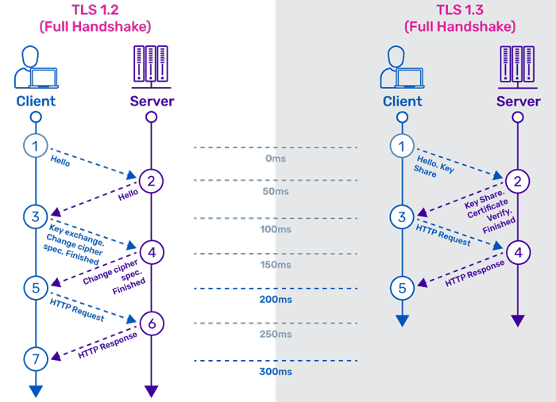

SSL (Secure Sockets Layer) and TLS (Transport Layer Security) are cryptographic protocols designed to secure data transmission over networks, particularly the internet. This document summarizes the key concepts of SSL/TLS and how they function to ensure secure communication.

**1. Understanding SSL and TLS**

SSL was developed in 1995 to encrypt data transmission but has since been deprecated.

TLS is the successor to SSL and offers improved security measures.

Despite SSL being outdated, the term is still widely used to refer to TLS.

2. **The Importance of SSL/TLS**

The internet consists of interconnected computers, meaning any transmitted data passes through multiple servers.

Without encryption, personal and sensitive data such as credit card details, passwords, and addresses are at risk of interception.

SSL/TLS encrypts this data, ensuring confidentiality and integrity.

3. **Identifying Secure Websites**

Websites secured with SSL/TLS use "HTTPS" instead of "HTTP" in their URL.

The "S" in HTTPS signifies a secure connection using encryption.

Users should avoid entering sensitive information on websites that lack HTTPS.

4. **The SSL/TLS Handshake Process**

The handshake process is a series of steps that establish a secure connection between a client (browser) and a server:

The browser sends a Client Hello message, listing supported encryption methods.

The server responds with a Server Hello, selecting an encryption method and providing its SSL certificate.

The browser verifies the SSL certificate’s validity.

If the certificate is valid, the browser generates a session key, encrypts it with the server’s public key, and sends it to the server.

The server decrypts the session key with its private key.

Both parties confirm encryption details, and a secure connection is established.

5. **When to Use SSL/TLS**

SSL/TLS should be used whenever transmitting sensitive information.

This includes login credentials, financial data, personal details, and any confidential communication.

6. **SSL Certificates**

SSL certificates authenticate the identity of websites and facilitate encrypted communication.

Certificates can be obtained for free or through paid services.

Free SSL certificates (e.g., Let’s Encrypt) are suitable for basic security needs.

Paid SSL certificates offer enhanced security, warranties, and are ideal for businesses handling sensitive transactions.

7. **Choosing the Right SSL/TLS Certificate**

Free SSL: Best for personal websites, blogs, and small-scale applications.

Paid SSL: Recommended for e-commerce, banking, and high-traffic websites requiring strong security.

8. **Monitoring and Maintaining SSL Security**

SSL certificates expire and need periodic renewal (typically every 90 days for free certificates).

Websites should implement monitoring tools (e.g., Sematext Synthetics) to track certificate validity and performance.

Regular updates and security audits help maintain SSL integrity.

Conclusion

SSL/TLS encryption is essential for secure communication over the internet. Whether opting for free or paid SSL certificates, ensuring a website’s security is crucial for protecting user data. Regular monitoring and renewal of SSL certificates further enhance website security and user trust.